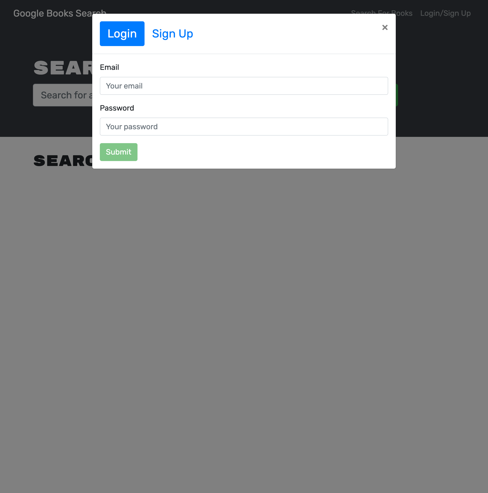

# book-finder

## Description

This awesome book finder webapp will find anybook you could ever want to read. Leveraging googl's books API when a user searches for the book they desire a list of all books is displayed and only if they are logged in allows them to add a book to there saved books. This can come in handy if you want to know a little more about any book.

             

## Table of Contents

- [Installation](#installation)
- [Usage](#usage)
- [Credits](#credits)
- [License](#license)

## Installation

Deployed on Heroku at https://pacific-dusk-80662.herokuapp.com/

## Usage

## Credits
Penn University Full Stack Bootcamp

## License

MIT License

Copyright (c) 2022 Ray Hewitt

Permission is hereby granted, free of charge, to any person obtaining a copy
of this software and associated documentation files (the "Software"), to deal
in the Software without restriction, including without limitation the rights
to use, copy, modify, merge, publish, distribute, sublicense, and/or sell
copies of the Software, and to permit persons to whom the Software is
furnished to do so, subject to the following conditions:

The above copyright notice and this permission notice shall be included in all
copies or substantial portions of the Software.

THE SOFTWARE IS PROVIDED "AS IS", WITHOUT WARRANTY OF ANY KIND, EXPRESS OR
IMPLIED, INCLUDING BUT NOT LIMITED TO THE WARRANTIES OF MERCHANTABILITY,
FITNESS FOR A PARTICULAR PURPOSE AND NONINFRINGEMENT. IN NO EVENT SHALL THE
AUTHORS OR COPYRIGHT HOLDERS BE LIABLE FOR ANY CLAIM, DAMAGES OR OTHER
LIABILITY, WHETHER IN AN ACTION OF CONTRACT, TORT OR OTHERWISE, ARISING FROM,
OUT OF OR IN CONNECTION WITH THE SOFTWARE OR THE USE OR OTHER DEALINGS IN THE
SOFTWARE.

## Badges

## Features
- Create a user
- Get information about any book
- Add books to your book list
- login/out functionality

## How to Contribute

 https://github.com/Rayman244/book-finder

## Tests
 No errors to report
  
 ## Questions
 message me on Github https://github.com/Rayman244/
 email me at [rayhewitt42@icloud.com](mailto:rayhewitt42@icloud.com)